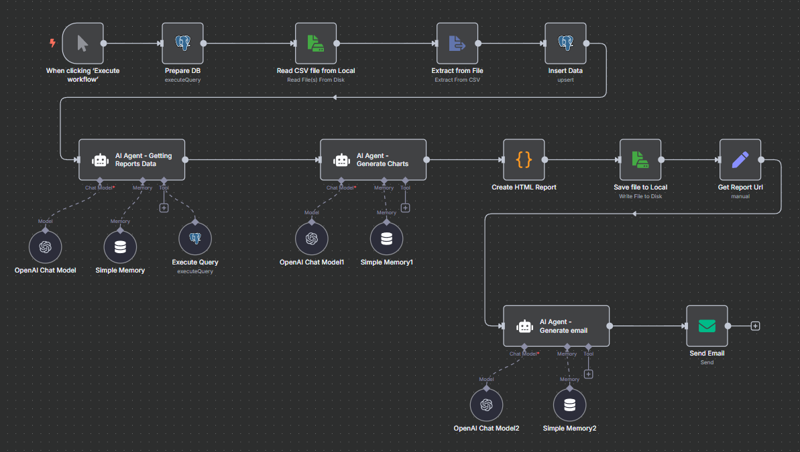
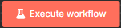
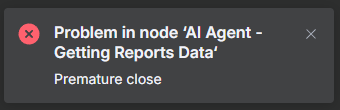
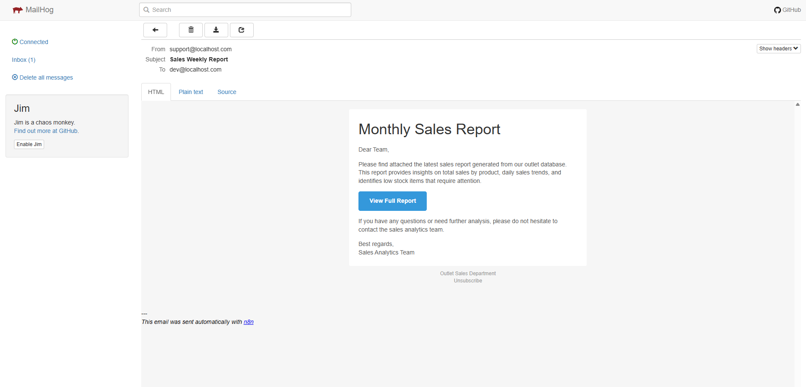
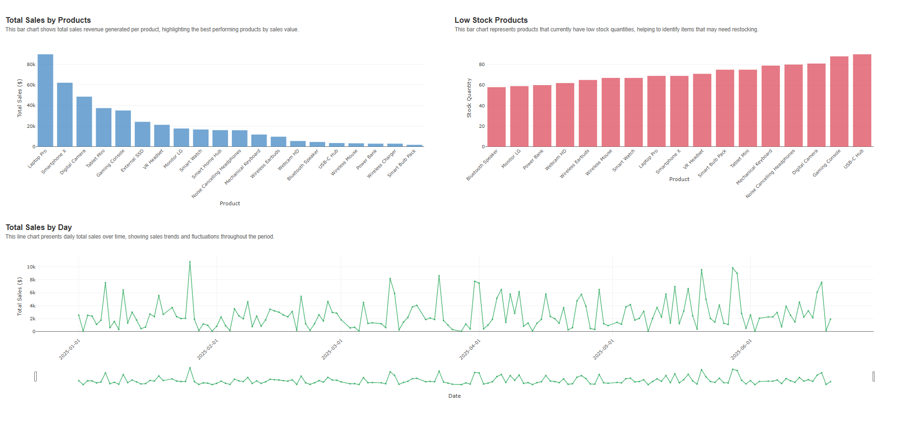

# CSV Sales Report Email

This project demonstrates how to use AI-powered workflows to automate the generation and delivery of sales reports from CSV data. It is designed as a learning resource for integrating AI agents into reporting pipelines.



## Workflow Summary

---

This workflow automates the process of generating and emailing a sales report from CSV data:

1. **Database Preparation:** Sets up the required PostgreSQL schema and table for transactions.
2. **CSV Extraction:** Reads sales data from a CSV file.
3. **Data Insertion:** Loads the extracted data into the database.
4. **AI-Powered Reporting:** Uses an AI agent to generate SQL queries for sales analytics (e.g., total sales by product, low stock, daily sales).
5. **Chart Generation:** Another AI agent creates visual charts (bar and line) from the report data using Plotly.js.
6. **HTML Report Creation:** Generates an HTML report containing the charts.
7. **File Storage:** Saves the HTML report locally and generates a public URL.
8. **Email Generation:** Uses an AI agent to create a responsive HTML email with the report link.
9. **Email Sending:** Sends the sales report email to the intended recipient.

### Docker Compose Services

- **n8n:** Workflow automation tool that orchestrates the CSV extraction, data processing, report generation, and email sending. Exposes a web interface on port 5678.
- **outlet-db:** PostgreSQL database used to store sales transactions imported from the CSV file. Exposes port 5432 for database access.
- **mailhog:** Email testing tool that captures outgoing emails for development and testing. Web UI available on port 8025, SMTP on port 1025.
- **nginx:** Serves generated HTML reports and acts as a reverse proxy. Exposes reports on port 8080.
- **n8n-setup:** Initialization container that configures n8n with workflows and credentials using a Python script at startup.

## Before Start

---

Before running this project, make sure you have the following prerequisites:

1. **Docker & Docker Compose:**
   - Install [Docker](https://docs.docker.com/get-docker/) and [Docker Compose](https://docs.docker.com/compose/install/) on your system.

2. **OpenAI API Token:**
   - Obtain a valid OpenAI API token from [OpenAI](https://platform.openai.com/account/api-keys).

3. **Environment Variables (.env file):**
   - Create a file named `.env` in the project root directory.
   - Add the following content to the file, replacing with your actual OpenAI token:
     ```env
     N8N_EMAIL=dev@localhost.com
     N8N_PASSWORD=Dev12345
     OPEN_AI_API_KEY=your_openai_token_here
     ```

## Running the project

---

To start the project using Docker Compose, follow these steps:

1. Make sure your `.env` file is properly configured in the project root.
2. Open a terminal in the project directory.
3. Run the following command to build and start all services in the foreground:
   ```sh
   docker-compose up --build --force-recreate --remove-orphans
   ```
4. Once all services are running, wait until the `n8n-setup` service has finished its initialization (you will see it exit in the terminal). Then, open your browser and go to [http://localhost:5678](http://localhost:5678) to access the n8n UI.
5. Log in using the credentials you set in your `.env` file (`N8N_EMAIL` and `N8N_PASSWORD`).
6. In the n8n UI, locate the workflow `csv-report` in the workflow list.
7. Click on the workflow to open it, then click the  button to run the workflow and generate the sales report.

> **Note:**
> If you encounter an error of type 'premature close' when running the workflow, simply rerun the workflow. This error can occur due to network or initialization timing issues and is usually resolved by retrying.
>
> 

8. After the workflow finishes successfully, you can check the sent email:
   - Open your browser and go to [http://localhost:8025](http://localhost:8025) to access the MailHog web interface.
   - You should see the sales report email in the inbox. Click on it to view the contents and verify the report.

   - Example of a successful email in MailHog:

     

     _The screenshot above shows the sales report email as it appears in the MailHog inbox after a successful workflow execution._

        > **Note:**
        The email template used for the sales report notification is based on the open-source template from [leemunroe/responsive-html-email-template](https://github.com/leemunroe/responsive-html-email-template/blob/master/email.html).

   - When you click the button or link in the email, it will open the generated sales report with interactive charts, similar to the example below:

     

     _This screenshot shows the type of charts included in the sales report, such as sales by product and daily sales trends._

9. To stop the services, press `Ctrl+C` in the terminal.

> **Note:**
> The appearance of the email and the generated charts may vary depending on the AI agents' output and configuration. The provided examples are for reference only.

